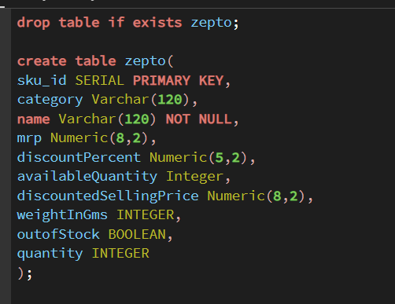
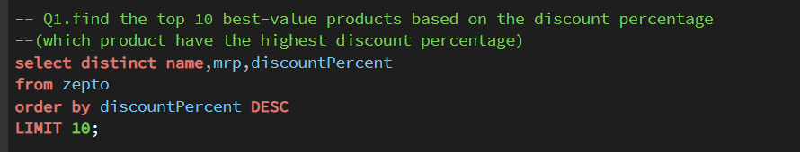
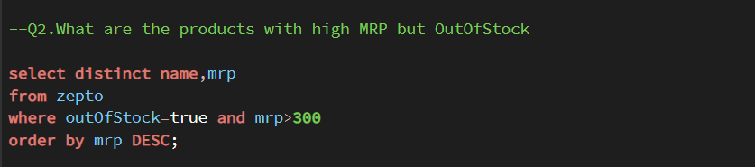
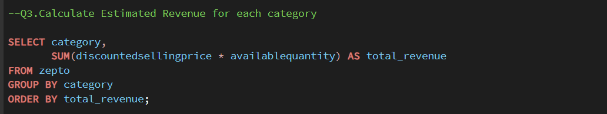
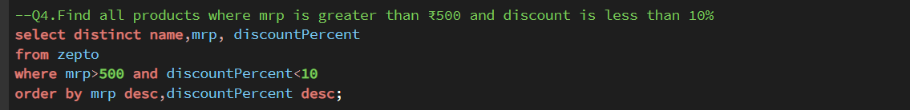
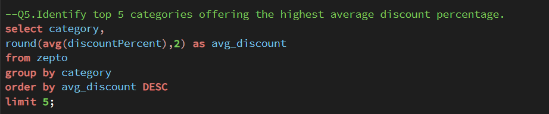

# 🛒 Zepto E-commerce SQL Data Analysis

## 📌 Project Overview

This project focuses on analyzing Zepto e-commerce inventory data using **SQL and PostgreSQL**.

The objective is to explore product pricing, discounts, stock availability, inventory weight, and estimated revenue to generate meaningful business insights.

---

## 🎯 Project Objectives

- Analyze product pricing and discount patterns
- Identify highly discounted products
- Find high-MRP products that are out of stock
- Calculate estimated revenue for each product category
- Identify products with high MRP and low discounts
- Find categories offering the highest average discounts
- Analyze inventory and product availability

---

## 🛠️ Tools & Technologies

- **SQL**
- **PostgreSQL**
- **pgAdmin 4**
- **GitHub**
- **CSV Dataset**

---

## 📂 Dataset

The dataset contains Zepto e-commerce product and inventory information.

### Important Columns

| Column | Description |
|---|---|
| `sku_id` | Unique product identifier |
| `category` | Product category |
| `name` | Product name |
| `mrp` | Maximum Retail Price |
| `discountPercent` | Discount percentage |
| `availableQuantity` | Available quantity |
| `discountedSellingPrice` | Selling price after discount |
| `weightInGms` | Product weight in grams |
| `outOfStock` | Indicates whether the product is out of stock |
| `quantity` | Product quantity |

---

## 🔍 Business Questions

### Q1. Top 10 Best-Value Products

Find the top 10 products based on the highest discount percentage.

### Q2. High MRP Products That Are Out of Stock

Identify products with an MRP greater than ₹300 that are currently out of stock.

### Q3. Estimated Revenue by Category

Calculate estimated revenue for each product category using:

**Discounted Selling Price × Available Quantity**

### Q4. High MRP Products With Low Discount

Find products where:

- MRP > ₹500
- Discount < 10%

### Q5. Categories With Highest Average Discount

Identify the top 5 categories offering the highest average discount percentage.

---

## 🧠 SQL Concepts Used

- `SELECT`
- `WHERE`
- `DISTINCT`
- `GROUP BY`
- `ORDER BY`
- `LIMIT`
- `SUM()`
- `AVG()`
- `ROUND()`
- Aggregate Functions
- Boolean filtering
- Arithmetic operations
- Aliases

---

## 📊 Project Screenshots

### 1. Table Structure



### 2. Top 10 Discounted Products



### 3. High MRP & Out-of-Stock Products



### 4. Estimated Revenue by Category



### 5. High MRP & Low Discount Products



### 6. Top Categories by Average Discount



---

## 📁 Repository Structure

```text
Zepto-SQL-Data-Analysis/
│
├── README.md
├── Zepto_SQL_Analysis.sql
├── zepto_v2.csv
│
└── screenshots/
    ├── 01_table_structure.png
    ├── 02_top_discounted_products.png
    ├── 03_high_mrp_outofstock.png
    ├── 04_revenue_by_category.png
    ├── 05_high_mrp_low_discount.png
    └── 06_top_categories_discount.png
